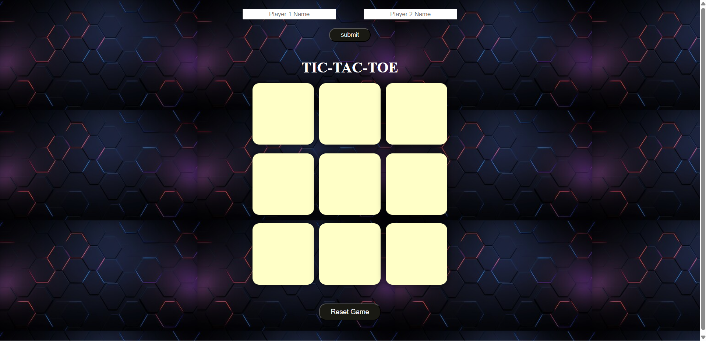
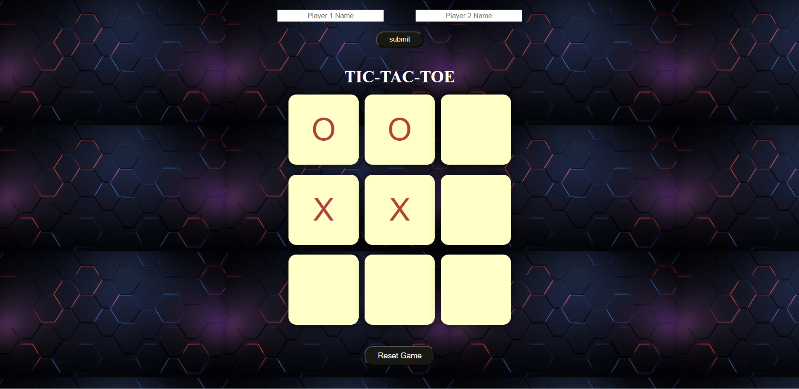
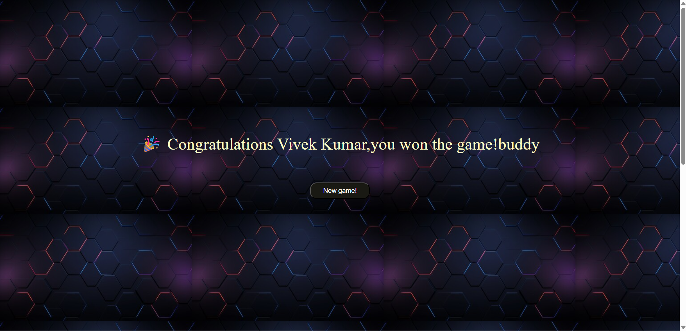
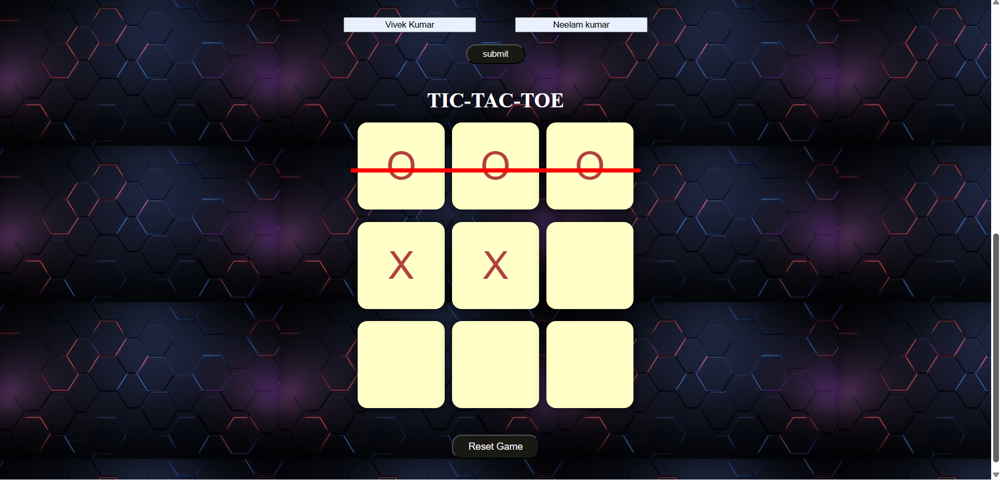

# 🎮 Tic Tac Toe Game

A simple and interactive **Tic Tac Toe game** built using **HTML, CSS, and JavaScript**.
This project demonstrates basic front-end development concepts such as **DOM manipulation, event handling, and game logic implementation**.

---

## 📌 Features

* Two-player gameplay (Player X vs Player O)
* Interactive game board
* Win detection logic
* Draw detection
* Game reset functionality
* Responsive and clean UI

---

## 🛠️ Technologies Used

* **HTML5** – Structure of the game
* **CSS3** – Styling and layout
* **JavaScript (Vanilla JS)** – Game logic and interactivity

---

## 📂 Project Structure

```
tic-tac-toe/
│
├── index.html        # Main HTML file
├── style.css         # Styling for the game
├── tictactoe.js      # Game logic
│
├── game-board.png    # Screenshot of game board
├── gameplay.png      # Screenshot of gameplay
├── wingame.png       # Screenshot showing winning state
├── wingame2.png      # Screenshot showing another winning example
│
└── README.md         # Project documentation
```

---

## 🖥️ Screenshots

### Game Board



### Gameplay



### Winning Screen



### Another Winning Example



---

## 🚀 How to Run the Project

1. Clone the repository

```
git clone https://github.com/your-username/tic-tac-toe.git
```

2. Open the project folder

```
cd tic-tac-toe
```

3. Open **index.html** in your browser.

---

## 🎯 Game Rules

* The game is played on a **3×3 grid**.
* Player **X** goes first, followed by **Player O**.
* Players take turns placing their mark in an empty cell.
* The first player to align **three marks horizontally, vertically, or diagonally** wins.
* If all cells are filled and no player wins, the game ends in a **draw**.

---

## 📚 Learning Objectives

This project helps in understanding:

* JavaScript **DOM manipulation**
* **Event listeners**
* **Game logic implementation**
* Basic **frontend project structure**

---

## 🔮 Future Improvements

* Add **AI opponent (Play vs Computer)**
* Add **scoreboard**
* Add **animations and sound effects**
* Improve **mobile responsiveness**

---

## 👨‍💻 Author

Developed by **Vivek Kumar**

If you like this project, feel free to ⭐ the repository!
